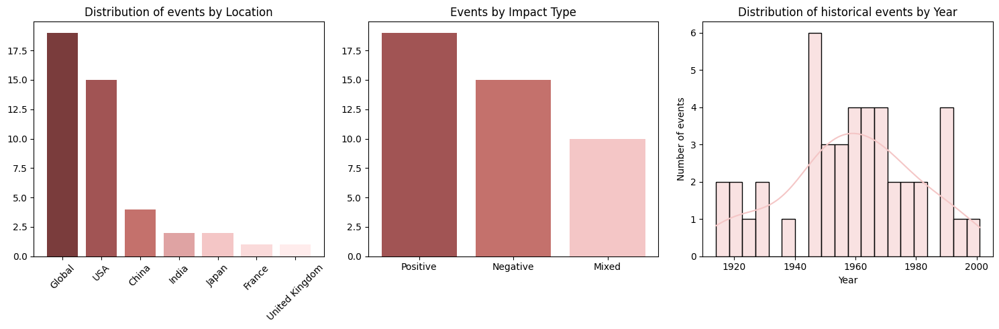
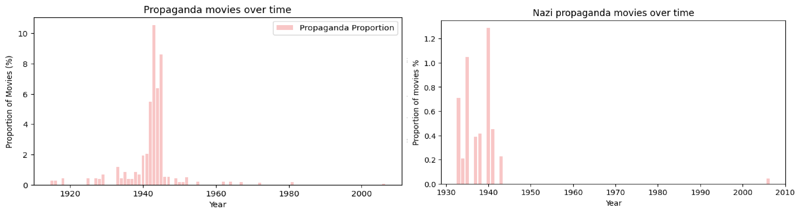
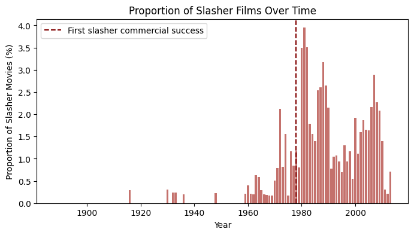
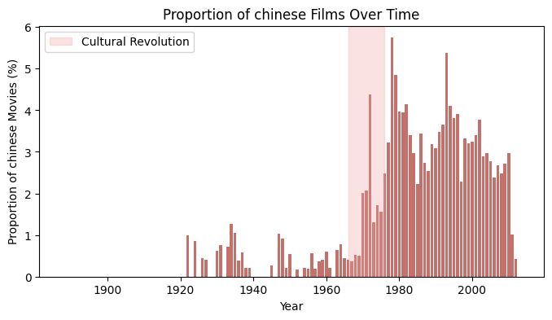
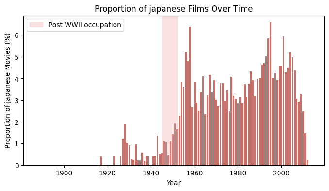
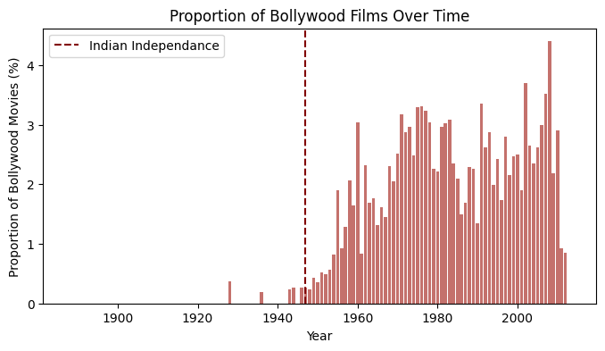
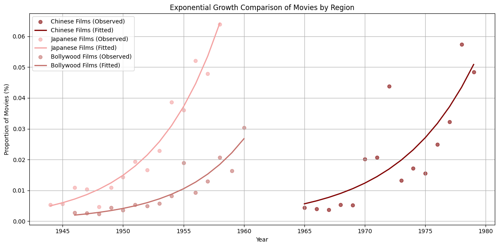

# Introduction

So, you're a movie writer looking for inspiration for your next project. The blank page can be pretty daunting, right? Don’t worry—we’ve got you covered. By harnessing the power of data analysis, we can uncover the next big trends in the movie industry together.

Cinema, though a relatively young art form, has been profoundly influenced by historical and sociological events. Could the thematic evolution of film serve as a mirror reflecting significant moments in history? How do major events shape cinematic trends? Which genres rise or fall in popularity during times of war or societal upheaval? Do action and drama films dominate, or do audiences gravitate toward escapist comedies during turbulent times? And are these trends periodic or long-lasting?

Join us on this analytical journey as we explore how pivotal societal events have influenced cinematic trends and shaped the popularity of different genres. We will characterize these trends to understand if determine whether they represent enduring shifts or fleeting peaks of popularity. Along the way, we’ll uncover  valuable insights into the next thematic wave of film releases, giving you the inspiration you need to pitch your next submission to producers—well before the deadline!
  

# I - History and Genre Trends 

First, let us take a look at all movie that have been released since the beginning of cinema. These movies are characterized by genres and a release date. These are the two parameters we will need for our study. Our first reflex would be to examine the temporal distribution of genres, and see if we can already see patterns there.

 

 

At this early point, aside from a clear variation of genres through time, there's already a couple of things we observe:

*   The rise of the “Musical” in the 1930s-1950s: This peak may coincide with the rise of Hollywood musicals after the Great Depression and during the Second World War, a period when entertainment was important.
*   The gradual decline of “Dramas” after 1940: This may be linked to a shift in public demand towards lighter or more spectacular genres (such as action and adventure).
*   The rise of “Thrillers/Suspense” and “Horror” after 1960-1980: May coincide with periods of social or political tension (Cold War, oil crisis). 
*   The rise of Action films from the 1980s: This could be linked to technological advances in special effects and the rise of iconic heroes. 

So we have our motivation! We're asking ourselves the right questions it seems.

Now we also need to take a look at History. World history is paved by an endless amount of events. Navigating through all of them would be endless and much too complicated to handle. Moreover, and quite thankfully, not every country has made box-office contributions. We just need to identify a manageable selection of key events to explore their influence on cinematic trends and movie releases. Whether these events be good, "positive", bad, "negative", they will serve as the influencial keypoints driving the trends we hope to see in movie genres.

 

 

Now that we are equipped with the basic tools to begin our analysis, we can get into the heart of the matter:

Picking out the most important movie genres, let’s take a first look at the potential correlations between our historical events and their distribution. We are looking for major shifts in the prominence of genres after selected timepoints.

 

 

 Some events are followed with more significant changes than others, and already we have intresting trends in the possibility of an influence they could have on the proportion of genres in movie releases. 

*  Comedy and Drama consistently dominate the overall genre distribution, regardless of the event period.

*  The proportions of action-related genres (Action and Adventure) tend to increase after certain events, possibly reflecting a cultural or societal shift toward escapism or hero-centric narratives.

*  Other genres, such as Musical and Horror, remain minor yet show specific spikes after certain events, suggesting a contextual influence.

Overall, for example, periods of conflict and upheavel seem to drive shifts toward action-oriented and reflective storytelling. 
So maybe it may not be such a bad idea to take a look at the news before you start writing. 

Some specific events stand out in terms of the influence on genre distribution: 

*  After World War II, the proportion of war films rose significantly. The introduction of Technicolor in 1916 coincided with an increase in war films, likely linked to World War I (1914–1918), while black-and-white films declined. For other events, the proportion of war films remained relatively stable before and after,

*  We have a notable increase in musicals following the Watergate Scandal and a rise in LGBT-themed films after the early Gay Rights Movements,

*  We see an emergence of Bollywood movies following the Indian Independence Act.

But we still have to try to understand the exact nature of the influence on the distribution of genres due to these events. Yes, major historical events do seem to be followed with some kind of change in the genres of films released at that time but how important is this change? Does it last more than a couple of years? Are the effects, if they are real effects, immediate or do that endure in the long term?

Because sure, you may find it a good idea to write a romance movie after the passage of laws on gay rights but will your movie be part of a short-lived trend? It might be smart to focus on these few significant events and take a closer look at several specific case studies to reinforce our analysis.
 
 

# II - Immediate or long lasting effect ?

Let us continue our historical analysis and cross-reference with variations in the film industry. Our goal is to determine whether such events lead to immediate, short-term spikes in the production of specific types of films or whether they contribute to long-term, sustained trends over time. By identifying these patterns, we aim to better understand the relationship between significant moments in history and their lasting impact on cinema. We want to make sure if it is worth the trouble of writing movies in such genres. 

Narrowing our focus to specific types of films through targeted case studies allows for more concrete insights and clearer conclusions. By examining these case studies, we can assess the influence on cinematic trends, determining whether this impact is periodic and short-lived or contributes to a sustained, long-term effect.

There are different types of events we can look into:
* [Major historical events](#major-historical-events), at a specific time, which have a resonating impact on society,
* [Technological advancements](#technological-advancements), which usher great changes in the industry, such as advancements in visual effects, sound, and cinematography, which bring clear impacts on filmmaking trends,
* [Commercially successful hits](#commercial-success-hits), that may set new standards or inspire a wave of similar films,
* [Rise in social movements](#impact-of-social-movements) which reflect changes in social norms and may shape themes and narratives depicted in movies,
* [Globalization](#globalization-and-integration-policies) and the political and economical openings towards other cultures.

Because these "timepoints" are quite different in nature, surely they will reflect differing impacts on the cinema industry, and this is what we want to establish.

 

## Major Historical Events

Let's delve into the historical events. We have a list of major events, and pairing them with a type of movie, we will test whether they lead to gradual sustained effect, or spikes in genre production.

1. [War Movies/ World War II](#-1---war-movies-and-world-war-ii)

2. [Propaganda movies/ World War II](#-2---propaganda-movies-during-world-war-ii)

3. [Political films/ Watergate scandal](#-3---political-films-and-watergate-scandal)

4. [Spy Movies/ Cuban Missile Crisis](#️️-4---spy-movies-and-the-cuban-missile-crisis)

5. [Rise of Musicals/ Great Depression](#-5---musicals-during-the-great-depression)

Each time, we will verify if the event has a statistically significant influence on our observations. We can perhaps try to fit a model, in the case when we would want to predict the behavior of genre releases in the future. This is something I am sure could come in handy for a film-writer such as you. 

 

### 🪖 1 - War Movies and World War II

Let's kick off our analysis with the most influencial event: World War II. If we look at War-themed movies, we have a significant increase during the 1940s, which aligns with World War II, suggesting that the conflict likely influenced the film industry. Another peak appears around the early 2000s. And this effect does not happen locally: it seems to have been the case in the EU just as it has in the USA.

 

 

 The theme of war is much more frequently portrayed from a dramatic rather than a comedic perspective. However, even if WWII had a global impact, experiences vary greatly from one region of the world to another. When comparing this proportion between European countries where war was being fought and, for example, the United States of America (chosen because it is the largest producer of movies worldwide), we see that the war comedic perspective is much more present. This is quite intresting because it expresses the cultural differences in the portrayal of war and we see how differently World War II had an impact on the film industry between the US and the EU.

 So we have a clear sharp and temporary increase of war movie production. But before we lose ourselves in all of these assumptions, it is worth checking that this increase is statistically significant. Don't start writing about wars just yet.

Fitting a model using R_squared as criteria, we maintain with statistical significance the dinstinct jump in War movie productions during and after the war. While the immediate effect is, once again, clear and confirmed, our model suggests that there is also a lasting influence and effect on this number. 

 

 

The fitted model shows a distinct jump in the predicted war movie proportions during WWII and a recalibrated level afterward, indicating that the war era fundamentally changed the landscape of war film production.
Our initial instinct about the short-term success was true. We however still observe a sustained trend over time, which could be influenced by overall opinion and social movements caused by such event.

 

### 🔰 2 - Propaganda movies during World War II

Again, staying in the theme of World War II, it could be worth looking at the behavior of Propaganda. More precisely Nazi Propaganda (hopefully this is not the type of movie you are aiming to write!). Looking at the distribution shows a gradual increase in the 30s as the political movement gains popularity. Quite reassuringly, its numbers fall to a complete halt after the War. Except for one small outlier in the 2000s. 

> 🤓 _Battle for Norway – Campaign 1940 is a German propaganda film produced by UFA in 1940 for the Wehrmacht. Long thought lost, it was rediscovered in 2000 by Norwegian film historian Jostein Saakvitne through a militaria online auction. The film, consisting of five rolls weighing 20 kilograms, was anonymously sold for under 1,000 euros. It premiered post-war in September 2006 at the Oslo Film Institute but was never shown in Germany._

Statistical analysis and model fitting of this distribution gives us confirmation that the contribution to the war in Nazi Propaganda movies is clear and brief. This decline reflects how Propaganda films can be context-dependent and do not sustain beyond the immediate historical moment.

But let's not stop here at something so evident. Let's look at propaganda movies as a whole. Analysis of the difference in numbers before, during and after the World War shows us that the proportion of propaganda movies decreases significantly after compared to during the war. Fitting a model confirms the presence of a clear pear during that event: World War II had a sudden brief impact on the film industry, most notably on propaganda. 

 This is something we probably could have guessed without too much problem but at least we are mathematically certain of one thing: Don't write a Nazi Propaganda movie now. 
 

 

### 🏅 3 - Political Films and Watergate Scandal

We're pretty confient that World War II had an effect on the silver screen by now. The world resonating impact of this event kind of speaks for itself. But it could be intresting to look at smaller and more local political events on the film industry overall:  The Watergate Scandal for example. 

> 🤓  _The Watergate scandal was a major political scandal in the 1970s where members of President Nixon's administration were involved in a break-in at the Democratic National Committee headquarters and subsequent cover-up, leading to Nixon's resignation in 1974._

 

 

At a first glance the increase in proportion of political films after the scandal is not clear. We can be sure that the event did not lead to any spikes in releases, but could it have lead to contributing to the sustained increase?

 

 

Although we do see a prominent increase in political movies following the Watergate scandal, statistical analysis and fitting of the model tell us that this observed rise is not linked to the political event and it is unlikely that the scandal lead to any sustained change, whether it be only in the US or in the world as a whole. 
So not all political events have an impact on movie releases. Good to know. Hopefully you still learned something. 

 

### 🕵️‍♂️ 4 - Spy Movies and The Cuban Missile Crisis

Another big political event of the Cold War that shook the public opinion in the US is the Cuban Missile Crisis. Let's try again to see how this time-mark influenced overall movie release trends. 

> 🤓 _The Cuban Missile Crisis was a tense 13-day standoff in October 1962 between the United States and the Soviet Union over the installation of Soviet nuclear missiles in Cuba, bringing the world to the brink of nuclear war before a peaceful resolution was reached._

 

 

We notice a big peak following the Cuban Missile Crisis, a time when people were anxious about the threat of nuclear war. This fear likely made Cold War themes feel more relevant and sparked greater interest in the spy genre during that period.

 

 

This time the significance is verified! Using a Kernel Density Distribution, we can cofirm that the event caused a greatest rise in political movies two years after the event, which is consistent with the timeframe needed to write, produce and release a movie. 

Political events *can* have an impact on releases, just not on all of them. Pick your political scandals wisely.  

 

### 🎶 5 - Musicals during The Great Depression

Another fun experiment would be looking at something a bit more contradictory: Musicals and the Great Depression. Did this period of great misery for the american population push people towards entertainment as an escape? It is worth looking into the popularity of these types of movies do in times of social despair. 

> 🤓 _The Great Depression (1929–1939) was a severe global economic downturn marked by widespread unemployment, bank failures, and a dramatic decline in industrial production and trade, triggered by the 1929 U.S. stock market crash._

 

 

The marked period does indeed seem to prompt a need for escapism. Fitting a model to predict the trend seems to show that there is indeed a significant increase during that period, with a pretty intense peak, and is also sustained post-Depression with a lingering effect. 

 

 

Notably, the lasting rise in musicals post-Depression could also be aligned with the advent of synchronized sound which revolutionized the industry (_The Jazz Singer (1927)_), before which the music of films came from the orchestra. Indeed, people needed music at that time and perhaps the Depression motivated this technical advancement even more. 

In any case it is clear that historical technical developments in the industry had an impact on preferences and genres. 

 

## Technological Advancements

So let's take a look at technological breakthroughs which bring about changes in the industry. Advancements in visual effects, sound, and camera systems will surely influence movie releases right? I'm sure more than one director decided to shoot a Documentary just to try out his fancy new drone. Here's three examples of inventions and advancements we can look into: 

1. [Science Fiction/ Special Effects Advancements](#-1---major-special-effects-advancements-late-1970s-and-science-fiction-movies)
2. [Black and White Movies/ Technicolor Technique](#-2---technicolor-technique-1916-and-black-and-white-movies)
3. [Silent Movies/ Sound Technologies](#-3---sound-technologies-1927-and-silent-movies)

 

### 🛸 1 - Major special effects advancements (late 1970s) and Science-Fiction Movies

Most likely advances in visual techniques brought about a whole new set of horizons for movie producers and writers such as you. 

 

 

The proportion of science fiction movies saw a steep increase starting in the mid-1970s, coinciding with the emergence of the blockbuster era. This growth was likely fueled by the adoption of advanced visual effects techniques, including the introduction of Computer-Generated Imagery (CGI) between 1973 and 1982, as well as the use of motion control cameras and animatronics, which gained prominence in the late 1970s. The continued surge in the 1980s may also be attributed to a renewed public fascination with space exploration, for example by the launch of the Space Shuttle program in 1981.

 

### 🎨 2 - Technicolor technique (1916) and Black-and-white Movies

Let there be color! The first colorized film appeared on screen in 1902, but it was the invention of technicolor in 1912 that truly changed the accessibility of producing a color film. This substractive technique was way less expensive then previous additive techniques used.

 

 

So the decline of the prevalence of black-and-white movies can be easily explained by the invention of the first technicolor technique in 1916, which was later improved. Progressively, color films became more affordable and accessible and overtook black-and-white movies. If you write a black-and-white movie now, you're sure to stand out! Not sure if producers will be happy though.

 

### 📢 3 - Sound Technologies (1927) and Silent Movies

Before color and CGI, the most obvious influencial change to the industry is probably sound. The introduction of sound in movies became possible with the Vitaphone system invented in 1927. The release of The Jazz Singer, the first movie with dialogue and music, was a turning point. Silent films became rapidly obsolete.

 

 

The data is pretty straightfoward here. Include sound in your movie; its the safest choice.

 

## Commercial Success Hits

Big success hits are great sources of inspiration, I'm sure you will agree. How about we see how blockbuster hits catch the attention of other filmmakers and studios eager to replicate their success? One great idea often inspires others to do the same and many hits serve as cinematographical 'touchstones', which define new standards and trends that shape the industry. Let's examine this behavior with our genres and our analysis of trends.

1. [Slasher Movies/ First Slasher Commercial Success](#-1---slasher-movies)
2. [Martial Arts Movies/ Bruce Lee Success](#️-2---bruce-lee-and-martial-arts-films)

 

### 🪓 1 - Slasher Movies

The emergence of the first slasher movies revolutionized the film industry by introducing a new genre defined by suspense, graphic violence, and psychological tension, paving the way for a wave of subsequent films that capitalized on their popularity and iconic formula that seemed to work so well the first time.

 

 

Over 80 years, the magnitude increases nearly 15-fold, highlighting the significant impact of exponential growth over extended periods. This shows that Slasher movies exhibit continuous and accelerating change.Some early slasher movies had a probable drive in these rising successes. 
_Halloween (1978)_, for example, is a low-budget film that grossed $70 million, proving the profitability of the genre. Studios quickly hopped on the bandwagon, producing a flood of slasher films to meet audience demand. In the 1980s, the genre is flourishing and the appearance of VHS in the 1980s allowed slasher films to thrive beyond theaters. These movies were inexpensive to produce and highly profitable on home video which explains why their proportion remained quite high for the past years.

 

 

### 🤸🏻‍♂️ 2 - Bruce Lee and Martial Arts Films

Our favorite street fighter! Bruce Lee’s debut films transformed martial arts cinema, reshaping the genre's place in the film industry. His first major commercial success, _The Big Boss (1971)_, sparked a rapid expansion of martial arts films. The genre’s cost-effectiveness enabled studios to produce numerous films quickly, capitalizing on its growing popularity. The 1970s became the Golden Age of Hong Kong cinema, with studios like _Shaw Brothers_ and _Golden Harvest_ leading the charge and cementing martial arts as a global phenomenon.

 

 

 

 

Once more, we can fit an exponential curve pretty easily to the behavior of the proportion: Martial arts films started with a small footprint but have grown steadily at a moderate pace. Over 80 years, the genre’s presence has expanded significantly, nearly 14 times its initial size, with a doubling time of around 21 years. The rising of this growth coincides with the release of Bruce Lee's first movies.

 Now we can safely say that great box office hits lead the distribution of their corresponding genres as they set trends and examples, inspiring other writers like you to recreate their success.

 

## Impact of social movements

Unlike wars or other singular events, which are time-bound with clearly defined beginnings and ends, social movements present a more complex challenge when attempting to identify their influence on genre distributions. Their impact tends to unfold gradually and can persist over extended periods, making it harder to pinpoint direct correlations with shifts in cinematic trends.

To better understand this dynamic, we’ll examine several examples of sociological movements and analyze their effects on movie releases. In cases where specific genres show a sustained rise in popularity, exploring relevant themes and subjects within your film may prove to be a worthwhile endeavor.

[LGBT Movies/ Gay rights movements](#️-lgbt-movies-and-gay-rights-movements)

 

### 🏳️‍🌈 LGBT Movies and Gay rights movements

LGBTQ+ representation in cinema is likely tied to the long-term social progress of public opinion which is paced by several notable key milestones, such as the First Pride Marches or legal breakthroughs. It is worth noting if these milestones produce sudden spikes in popularity or contribute to the overall rise over time: we see noticeable growth after some of the milestones.

 

 

Although statistical analysis and model fitting using OLS regression indicate that these keystone events do not result in clear peaks in the number of movies related to the genre, LGBTQ+ representation in cinematography has shown a continuous rise throughout history. This is likely due to the gradual nature of societal and cultural breakthroughs, such as the acceptance of diverse sexualities over time.

 

 

This steady progress underscores the importance of cultural and societal shifts that build over time, rather than relying solely on singular events or milestones. As representation becomes more visible and diverse, it not only reflects evolving societal norms but also actively contributes to shaping them, and the film making industry accompanies this change. LGBTQ+ representation is something that continuously gains in popularity, and you’re pretty safe if you choose to do so in your movie.

 

## Globalization and integration policies

Globalization has profoundly influenced the film industry, not only through technological advancements that facilitate global distribution but also by fostering cultural exchange and integration. The political and economic opening of nations inspires filmmakers to tap into diverse markets, audiences, and narratives, resulting in noticeable shifts in the proportion of genres in movie releases. We can look at three examples of such changes in trends.

1. [Chinese Movies/ Cultural revolution](#-1---chinese-movies-and-the-cultural-revolution)
2. [Japanese Movies/ Post WWII occupation](#-2---japanese-movies-and-post-wwii-occupation)
3. [Bollywood/ Indian independance](#-3---bollywood-and-the-indian-independance)

 

### 🍜 1 - Chinese Movies and the Cultural Revolution

Chinese movies are intresting to look into because cinema was heavily used by the Communist Party as a tool for propaganda to promote Maoist ideology and revolutionary values. So the intertwining of cinema and politics, therefore history, must be quite explicit here.

> 🤓 _The Cultural Revolution was a sociopolitical movement in China from 1966 to 1976, initiated by Mao Zedong, the leader of the Chinese Communist Party (CCP). It was intended to reinforce communist ideology by eliminating remnants of capitalist and traditional elements from Chinese society and by consolidating Mao's control over the party and government._

While traditional theater, music, and literature were suppressed or destroyed during the Cultural Revolution, the movie industry was actively promoted. Films such as _The Red Detachment of Women_ (1970) and _Taking Tiger Mountain by Strategy_ (1970) were mandated for public viewing, becoming some of the most widely screened and influential productions of the time.

 

 

We have, as expected, a drastic peak in the 60s. The end of the Cultural Revolution in 1976 marked the decline of extreme political control over artistic expression. Filmmakers probably gained more freedom to explore diverse narratives at that point. 

Deng Xiaoping also initiated an Opening-up Policy in 1978 to welcome foreign investment, cultural exchanges, and globalization. So we see another peak in the early 1980s, demonstrating China's desire to showcase its culture globally.

 

### 🍱 2 - Japanese Movies and Post WWII occupation

Now looking at the close neighbors: Japan. This is a country which was also quite shaked by the War. Post-WWII, Japan experienced rapid industrial growth and urbanization during the U.S. occupation (1945–1952) and beyond. Cinema was greatly appreciated in american culture and it is quite unsurprising that the art find its place in japanese culture quite fast.

 

 

The growth of national income facilitated the expansion of cultural industries, including film production. Japanese filmmakers utilized cinema to delve into themes of loss, recovery, and societal transformation, mirroring the nation's post-WWII journey. Films also served as a form of soft power, projecting Japanese culture and values onto the global stage.

 

### 🍛 3 - Bollywood and the Indian independance

What other great film-making power exists in this globe? Bollywood! Let's see how indian cinematography evolved following the Indian Independence in 1947:

 

 

Independence is always accompanied with exacerbated feelings of national pride, social justice, and unity, which are reflected in the movie industry. Bollywood is truly a cultural ambassador, spreading Indian culture, music, and traditions globally. In the 1991, India adopted economic liberalization and opened its economy to global markets. This shift towards globalization is reflected in the second fast increase of Bollywood movies in the 1990s.

We looked at three cases of how globalization shapes the movie industry. If we compare the growth between the three of them we see similarities in the development of movie industries in China, Japan, and India during their respective time periods marked by important events.

 

 

For each country, a 14-year period—beginning one year before the event of interest—reveals a remarkable trend of exponential growth in movie production. Bollywood, for instance, experienced the fastest growth, with Japanese cinema close behind. Within just four years of Indian Independence and the end of World War II, the proportion of Bollywood and Japanese movies had doubled. What's particularly intriguing is the starting point of these industries. Chinese and Japanese films began with similar proportions, while Bollywood initially accounted for a much smaller share before India’s Independence. This exponential rise of Bollywood underscores how transformative moments in history can ignite creative and cultural revolutions in cinema.

 If you want to write a movie from a certain country, it could be quite handy to check its history: When did it get its independence? What is its current stance on globalization? 

 Whoa that's a lot of information to take into account. You should talk with a geopolitician, he's probably got a few good tips for you.

 

# Conclusion

There’s no clear and precise answer to how history influences movie releases; the results are highly variable and depend on each specific case. Sometimes, historical events lead to a sudden spike or drastic shift in behavior, while at other times, they contribute to longer-term trends. However, it’s evident that history has significantly shaped the movie industry. By examining past trends, you can gain valuable insights into how the industry evolves over time.

So we've taken you on quite a journey throught time and cinematography. Hopefully this has given you some kind of idea of how the trends in cinema are linked to our current times. Turn on the news! It can give you a starting point to write something, whether it be a unique piece which will stand out of the trends, or something safe that you are sure the current directors will go for because of popular demand. You can come back to this website whenever you need for more ideas and predictions of what the next releases will be. Now you know what to write about if you want to be sure to be in the times. Or what to write to stand out from the flock, but at your own risk! 

